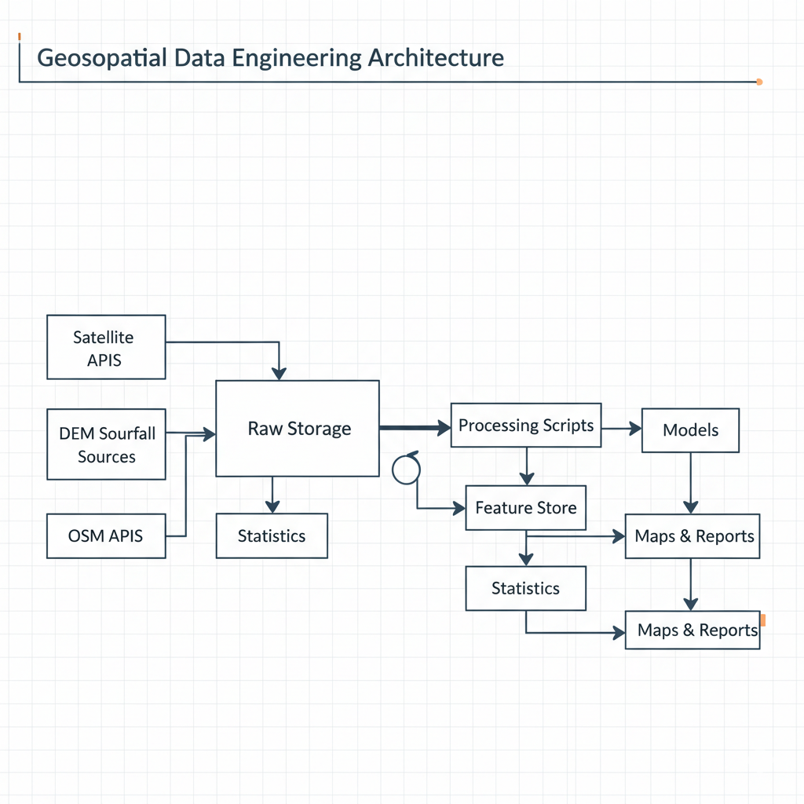
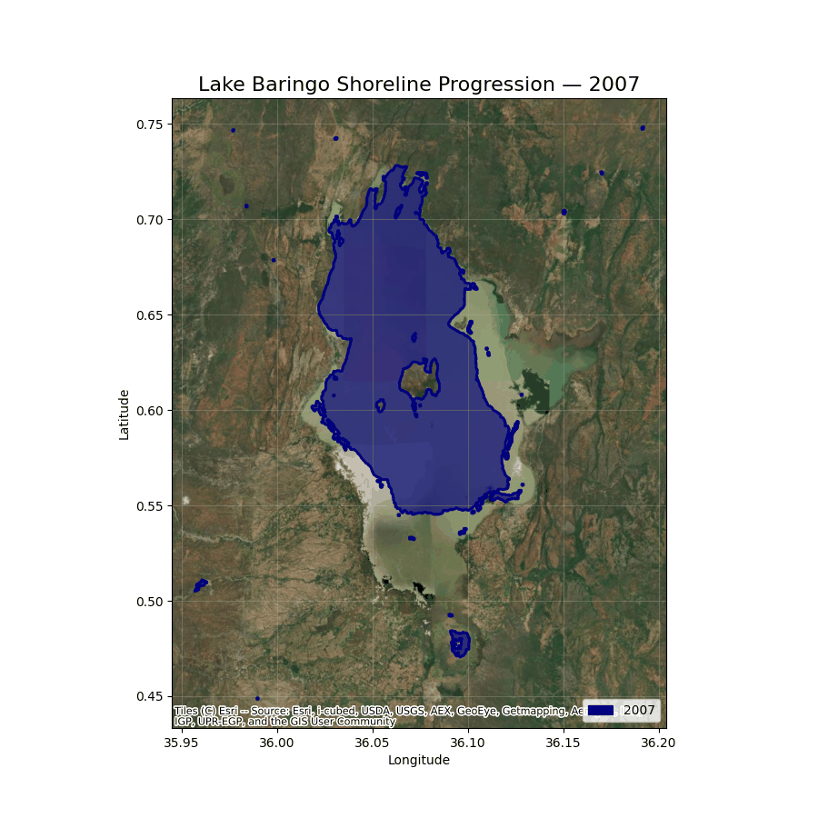

# Lake Baringo Shoreline Expansion Analysis

A remote sensing and geospatial data science project that measures, explains, and predicts shoreline expansion of Lake Baringo using satellite imagery, DEM analysis, and geospatial machine learning.

This project is designed to demonstrate real-world skills in:

* Remote sensing analytics
* Geospatial data engineering
* Environmental modelling
* Data pipeline design
* Reproducible research
* Decision-support visualization

---

# 1. Project Goal

Lake Baringo has experienced shoreline expansion in recent years, affecting settlements, infrastructure, and farmland.

This project answers three key questions:

1. How much has the lake expanded since 2007?
2. Which areas were affected?
3. Where is the lake likely to expand next?

The outputs are designed to support planners, NGOs, insurers, lenders, and county governments with clear, data-driven insight.

---

# 2. Data Science Approach (Remote Sensing + GIS)

## 2.1 Detecting Water Extent

Satellite imagery is used to detect water using Modified NDWI (MNDWI).

Steps:

* Download Landsat imagery
* Apply cloud masking
* Compute MNDWI
* Threshold water mask
* Vectorize shoreline polygons
* Clean strips / gaps
* Dissolve into single shoreline per year

Years analyzed:

* 2007
* 2016
* 2025

Outputs:

* Clean shoreline shapefiles
* Lake area statistics per year
* Change polygons (growth zones)

---

## 2.2 Measuring Impact

We compute:

* Area increase between years
* Infrastructure inside growth zones
* Land cover affected

Sources analyzed:

* OpenStreetMap buildings, roads, facilities
* Land cover classification

Outputs:

* Impact maps
* Tables of affected infrastructure
* Visual comparison maps

---

## 2.3 Predictive Modelling

Two modelling approaches were explored.

### Option A — Elevation-based Simulation

Hypothesis:
Lake expansion follows terrain elevation.

Steps:

* Extract shoreline elevation from DEM
* Fit elevation vs year model
* Project future water level
* Extract DEM areas below projected level

Outputs:

* Predicted 2030 shoreline
* Predicted lake area

---

### Option B — Machine Learning Water Prediction

Hypothesis:
Future water depends on terrain + rainfall + distance from shoreline.

Features used:

* DEM elevation
* Slope
* Distance from shoreline
* Rainfall history
* Vegetation trends

Labels:
Water / Non-water masks from historical imagery.

Model:
Random Forest classifier.

Outputs:

* Probability map of future flooding
* High-risk zones

---

# 3. Data Engineering Architecture

This project was built like a production pipeline, not a notebook-only analysis.

## 3.1 Pipeline Stages

1. Data ingestion
2. Preprocessing
3. Feature engineering
4. Analysis
5. Prediction
6. Visualization
7. Export

---

## 3.2 Architecture Diagram




---

## 3.3 Data Sources

Remote sensing:

* Landsat imagery

Terrain:

* SRTM DEM
* Copernicus DEM

Infrastructure:

* OpenStreetMap

Climate:

* CHIRPS rainfall
* ERA5 climate data

All data is automatically downloaded using Python scripts.

---

## 3.4 Folder Structure

```
project_root/
│
├── data/
│   ├── raw/
│   ├── processed/
│   └── features/
│
├── src/
│   ├── data/
│   ├── utils/
│   ├── analysis/
│   ├── prediction/
│   └── visualization/  
│
├── notebooks/
├── docs/
├── outputs/
└── README.md
```

---

# 4. Key Technical Skills Demonstrated

## Remote Sensing

* MNDWI water detection
* Cloud masking
* Landsat strip correction
* Raster to vector conversion
* Time series analysis

## GIS

* Buffering and overlay
* Spatial joins
* DEM analysis
* Shoreline extraction
* Impact zoning

## Data Engineering

* Automated data ingestion
* Raster tiling pipelines
* Parquet storage
* API integration
* Reproducible workflows

## Data Science

* Feature engineering for geospatial ML
* Classification modelling
* Validation with holdout years
* Uncertainty mapping

## Visualization

* Animated shoreline maps
* Comparative overlays
* Basemap integration
* Dashboard-ready outputs

---

# 5. Example Outputs

## Shoreline Comparison


## Lake Growth Animation



---

# 6. How to Run the Project

## 6.1 Setup Environment

```
pip install -r requirements.txt
```

## 6.2 Run Pipeline

```
python src/data/dataloader.py
python src/data/dem_features.py
python src/data/mndwi.py
python src/analysis/extent.py
python src/prediction/prediction.py
```

---

# 7. Results Summary

* Total increase(2025-2007): 104 km²


Predicted 2030 increase: 21 km²

High-risk zones identified around southern and eastern shoreline.

* Infrastructure inundated or at risk:    
Kenya Marine and Fisheries Research  
AIC Parking Lot  
Island camp Baringo  
Kenya Maritime Authority Baringo Office  
Baringo Eco Safaris  
JICA Green Bells Academy  
Salabani Primary School  
Ngambo Primary School  
Everfresh Dairy  
PAG Housing  
and many other buildings  
Hectares of farming land  
Tree cover  
Wetlands  

---

# 8. Real-World Applications

This analysis can support:

* County planning
* Disaster preparedness
* Agricultural insurance
* Agri-lending risk assessment
* Infrastructure planning
* Environmental monitoring

This aligns with the project goal of building geospatial systems that support data-driven decisions for sustainable development.

---

# 9. Future Improvements

* Add monthly time series instead of yearly
* Integrate rainfall forecast models
* Build interactive web dashboard

---

# 10. Author

Elkana Kipruto  
Geospatial Data Scientist & Data Engineer  
Interested in remote sensing, agriculture analytics, and environmental monitoring.

Portfolio projects include geospatial dashboards, drone crop analysis, NDVI time series modelling, and environmental monitoring tools.

---

# 11. License

MIT License

---

# 12. Contact

If you are interested in using this analysis for planning, research, or collaboration, feel free to reach out.

---
